# ✈️ **Aeris by Iasis**

**Team:** Ornob Hossen, Koh Shi Qi, Ruvenesvaran A/L Manivannan, Pang Yoke Leap (The team name is Iasis)

**Problem Statement:** Travel Planner

**Video Presentation:** [Unlisted Youtube Link]&nbsp;

**Presentation Slides:** [Public Link]&nbsp;

## 🌍 **1. Project Overview**

Nowadays, setting up a trip consists of using different tools at the same time to manage the whole trip to a single place. There is no separate setting in particular markets specifically for arranging a trip. A search on a travel app, a note on a notepad, a text to a friend and you have no single place to plan or manage the trip. For a single person or the organiser of any group, it can be a complex job to get suggestions and make decisions, receive notifications about them, and still have no way of knowing what is happening. This is the “planner’s tragedy” today. It is true that OTAs (e.g., Trip.com and Booking.com) built for general use can handle finding and booking, but they fail to do the rest properly. There is no common trip state, collective voting, approval trail, or anything similar. The AI-first trip planners that you see are more of a black box. Usually, they just suggest or provide a feed, or sometimes even book without clear, explicit human approval, which could be the main reason why travellers are hesitant to let them decide.

***Our Solution*****:** **Aeris is an all-in-one travel planning and booking platform with optional AI assistance**. Travellers can manually browse, filter, compare and book flights, accommodation, transport, attractions and activities at every stage — the AI never has to be involved. Optionally, Aeris AI reads a traveller's saved preferences, budget and calendar to recommend options, draft a day-by-day itinerary, coordinate a group's overlapping dates and budgets, and propose a revised plan when something changes. What makes Aeris different is that nothing books, pays, votes or reshuffles the itinerary without an explicit human approval — and every one of those approvals is recorded on a change history. The traveller always keeps the final selection, booking, payment and itinerary update.&nbsp;

**Feature set:**

1. **Travel Search, Browse, Filter and Comparison** — manual search across flights, accommodation, transport, restaurants, attractions and activities, with full filters, comparison and save-to-trip; AI suggestions sit alongside this, never replacing it.  
2. **Personalisation Profile and Google Calendar Connection** — dates, budget, interests and other preferences saved to a private, editable profile; permitted calendar availability informs (but never overrides) suggestions.  
3. **AI Recommendations and Itinerary Builder** — rule-based suggestion feed and draft itinerary that explains *why* each option fits, with accept/reject/replace/reorder always available.  
4. **Booking Checkout and Confirmation** — a single checkout summary (provider, dates, final price, taxes, conditions) that only proceeds after an explicit Confirm Booking.  
5. **Group Creation, Chat and Shared Planning** — an organiser invites members by link/code into a shared trip space with chat, shared itinerary and individual accounts.  
6. **AI Preference Matching, Private Voting and Personal Follow-up** — finds the shared date/budget/interest overlap, then runs private (hidden-until-close) votes on proposals.  
7. **Central Trip Dashboard and Calendar Synchronisation** — the one confirmed view of the trip that every flow returns to; approved events sync to each connected Google Calendar.  
8. **Automatic Replanning and Alternative Search** — detects delays, cancellations, closures or weather impacts and ranks alternatives within the remaining budget.  
9. **Multi-Currency Budget, Payment and Shared Expenses** — tracks planned/booked/actual cost in original and base currency, with equal/percentage/custom splits and simplified settlements.  
10. **Location, Navigation and Local Discovery** — routes and nearby suggestions from itinerary items, honest about whether travel/availability data is live, estimated or unavailable.  
11. **Review, Approval, Notifications and History** — the shared approval gate and audit trail behind every booking, vote outcome, accepted recommendation and disruption response.

## 💡 **2. Ideation & Process**

### 💭 **2.1 Ideas We Considered**

The product brief we converged on names of 5 broad solution directions, ranked from most to least central. Only four were kept.

| Idea | Why it was dropped / kept |
| :---- | :---- |
| **All-in-One Travel Planning and Booking Platform** (Chosen) | Kept as the foundation: manual browse/filter/compare/book must work completely on its own, so the product is never dependent on the AI actually being right.&nbsp; |
| **Personalised AI Travel Companion** (Chosen) | Kept as an optional layer on top of Idea 1, which is the profile, budget and calendar-informed suggestions and a draft itinerary.&nbsp; |
| **Collaborative Group Travel Planner** (Chosen)&nbsp; | Kept to remove the specific "chat-thread + spreadsheet" coordination tax that group organisers face: private preference submission, an overlap engine, and hidden voting instead of a poll no one answers.&nbsp; |
| **Adaptive Trip Management** (Chosen)&nbsp; | Kept because a confirmed itinerary that silently breaks on a real-world disruption (delay, cancellation, closure, weather) is a worse experience than no automation at all; changes must be ranked, reviewed and approved, never applied automatically.&nbsp; |
| **Language and Local Guide Companion** (Not Chosen)&nbsp; | Dropped because Google Translate and other apps has covered these features and users do not need to use our app for translation in real time while they can use the other app which is much more efficient than this app.&nbsp; |

### 🗺️ **2.2 Ideation Boards**

Our main ideation artefact is a set of flow diagrams. They sit on one shape language — green pill = start/end, blue = user input, grey = system action, diamond = decision, purple = the rule-based Aeris engine, amber hexagon = approval gate, red = error/alternative path, teal = the Central Trip Dashboard, dashed = deliberately out of MVP — so the whole set reads as one system rather than unrelated sketches.

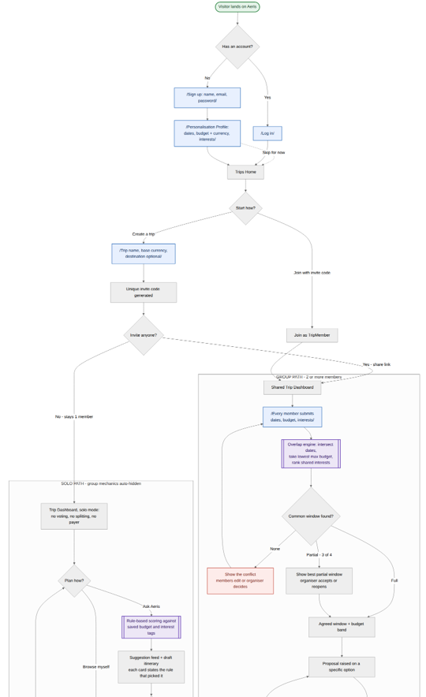

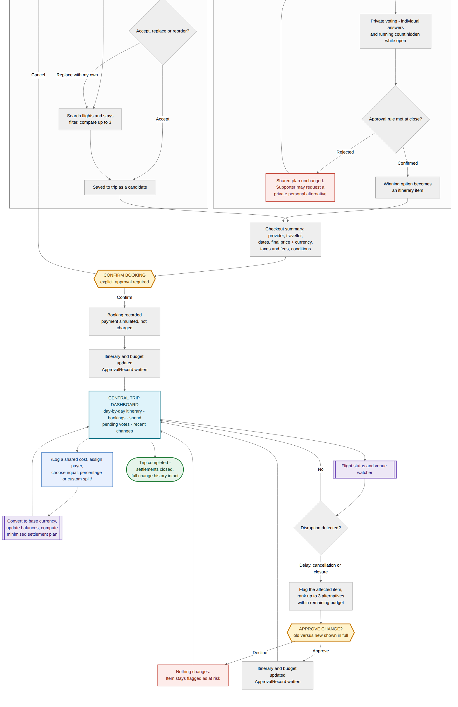
 
*Master flow - stranger to completed trip*

&nbsp;

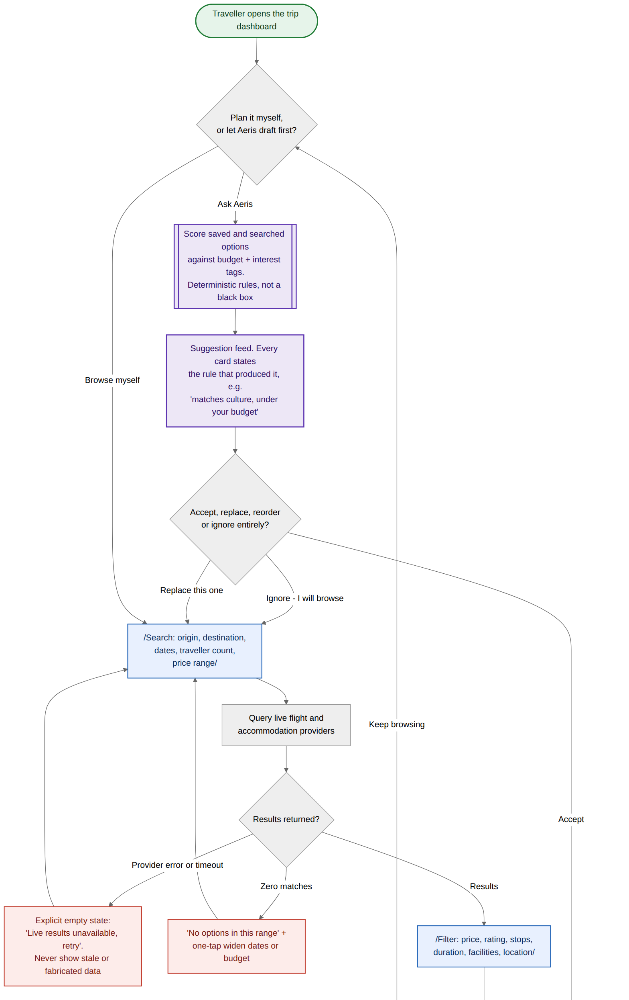

&nbsp;

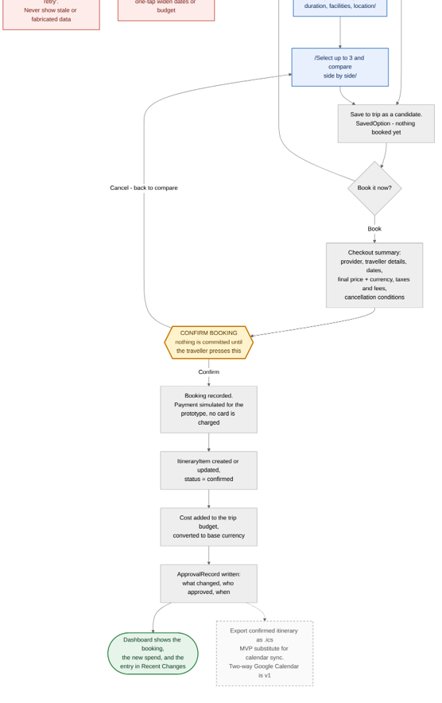
 
*Solo traveller - search, compare, book*

&nbsp;

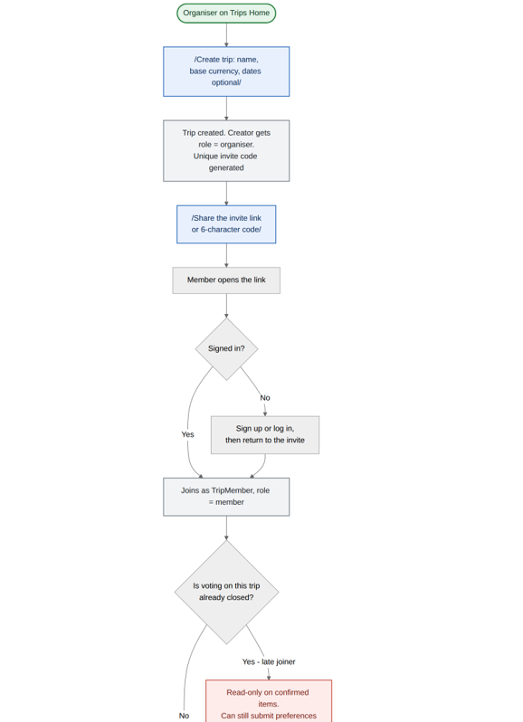

&nbsp;

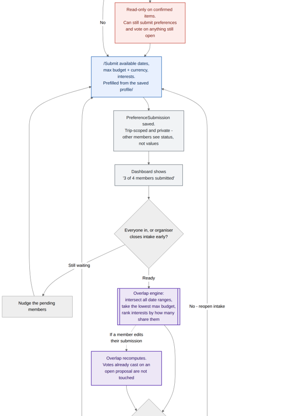

&nbsp;

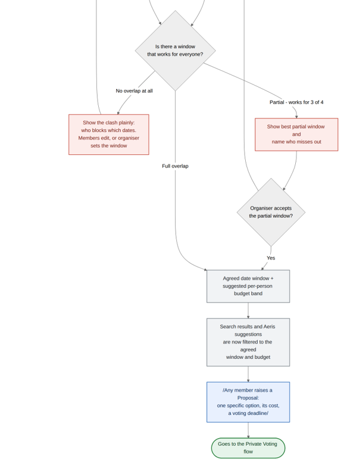
 
*Group organizer - create, invite, match preferences*

&nbsp;

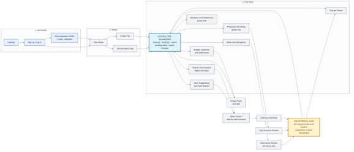
 
*Screen map - what actually has to be built*

&nbsp;

### 🤝 **2.3 Mentor Consultation**

| Date | Mentor | Feedback Received | What Was Changed |
| :---- | :---- | :---- | :---- |
| 9/9/2026 | Zach Khong | For the prototype we should upload it to Vercel and Next.js to host our app temporarily. Also gave good design libraries for the demo app.&nbsp; | Agree with this and hosted the demo app using Vercel and Next.js. Some given libraries provided are also used.&nbsp; |
| 10/9/2026 | Janelle Tan | Gave a lot of good tips about the prototype video and what to expect from the judges.&nbsp; | Agree with this and for the prototype video we used her explanations to tweak what gaps we have within the video.&nbsp; |
| 12/9/2026 | Mah Qing Fung | Advised to cut off many functions such as Google Calendar from the prototype video of the app.&nbsp; | Disagree with this and will just briefly explain these functions shortly because it was important for our ideation of the app.&nbsp; |

## 🎨 **3. Design & Prototype**

**UI Prototype:** [ [https://aeris-rust.vercel.app](https://aeris-rust.vercel.app) ]

The prototype is built as a Next.js app with one screen component per flow-map entry; below are the key screens to walk through, matched to the flows above.&nbsp;

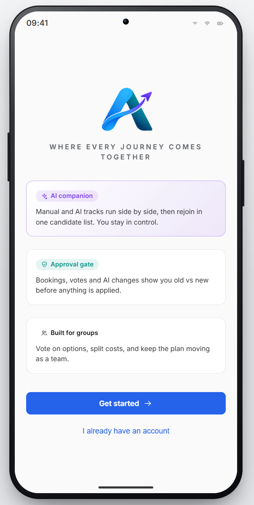
 
*This is the first page of the app before users signup/login for the app.*

&nbsp;

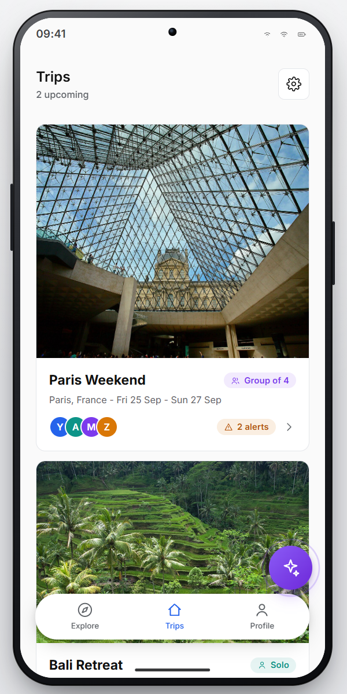
 
*This is the main dashboard of the app after users login.*

&nbsp;

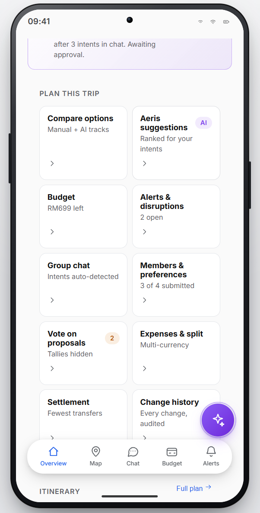
 
*This is the overview of the trip planning, which users can choose either group trip or individual.*

&nbsp;

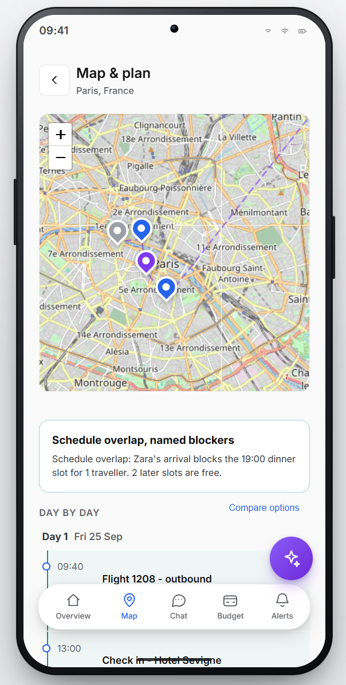
 
*This is the map in the panning trip showing the destinations planned for the trip.*

&nbsp;

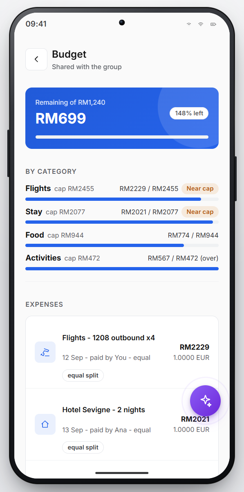
 
*This is the budget tab in the planning trip showing the budgets and expenses in the trip planned.*

&nbsp;

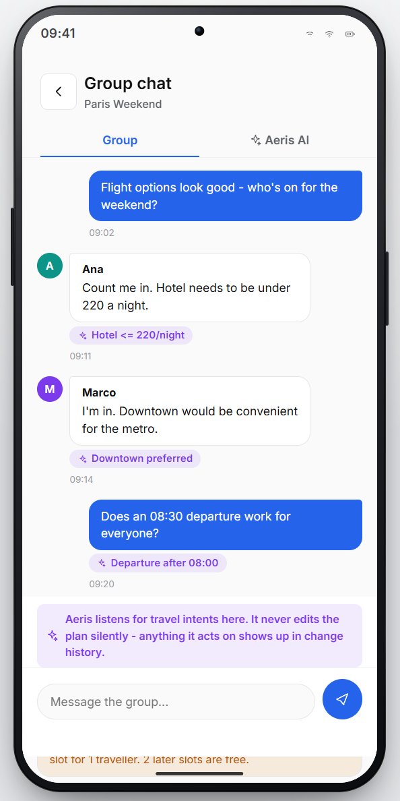
 
*This is the group chat function of the group planning which allow users discuss their travel plans.*

&nbsp;

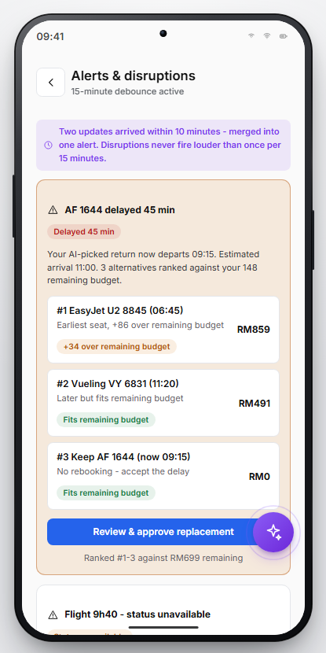
 
*This is the alerts of the planning trip, showing alerts about flight delays and other changes.*

&nbsp;

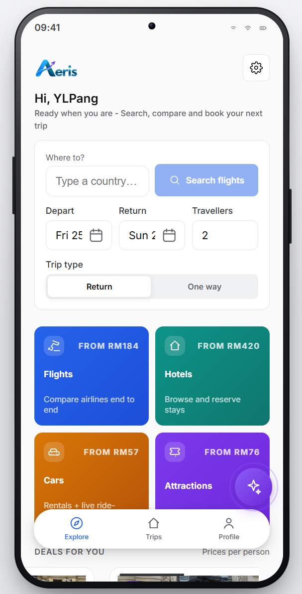
 
*This is the explore tab for users to book flights, hotels,cars, and attractions.*

&nbsp;

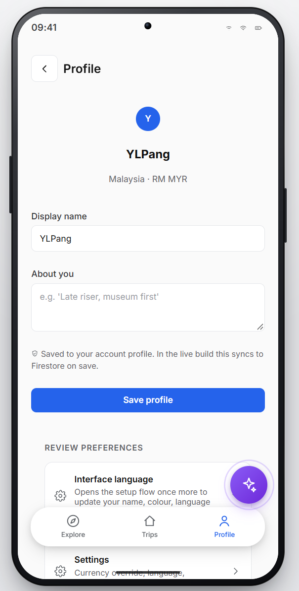
 
*This is the profile tab for users to edit their profile info.*

## ⭐ **4. What Makes It Different**

* **The approval gate is one shared component, not a policy.** Every booking, vote outcome, accepted recommendation and disruption response (FL-02, FL-04, FL-05, FL-06) passes through the same review-and-confirm step (FL-07) before anything is written — old vs. new schedule, old vs. new cost, conditions, who's affected. Browsing, filtering and draft suggestions are explicitly ungated, so "always ask" never becomes a click-through habit.  
* **Two tracks, one destination.** Manual search and Aeris AI suggestions start from the same screen and rejoin at the same candidate list — the AI is a fork in the path, never a toll gate. A traveller who ignores it entirely still reaches a booked trip.  
* **Hidden-until-close private voting.** Individual votes and the running tally are hidden from everyone — including the organiser — until the proposal closes, when the outcome reveals to all members at the same moment. Most group tools show a live tally, which is exactly what makes people vote with the room instead of their own preference.  
* **A dignified exit from a lost vote.** A member who preferred the rejected option can privately ask Aeris for a personal alternative that is never posted to the group — a social design decision as much as a technical one.  
* **Solo is not a stripped group trip.** At one member, voting, splitting and payer assignment don't appear greyed out — they're absent. The same code path serves both; group machinery collapses to a no-op instead of nagging a solo traveller.  
* **An unknown is never a false reassurance.** When no live disruption data exists for a route or venue, the item reads "status unavailable" — never a default "on time" — and a 15-minute debounce stops a delay that resolves itself from generating an alert.  
* **A settlement engine, not a ledger.** Shared expenses convert and store both the original and base-currency amount, validate that splits reconcile before writing anything, and compute the *fewest* transfers that clear every balance — with both sides confirming before a debt is marked settled.  
* **Rejections are recorded too.** A declined booking, vote outcome or disruption response still writes an ApprovalRecord and appears in Recent Changes as a decision that was made — turning the log into an account of the trip, not just a list of successes.

**One sentence**: every other planner asks you to trust it, Aeris asks you to approve it.

## 🛠️ **5. Technical Architecture & Feasibility**

**Tech stack**

| Layer | Tech Stack Used | Why and the Constraints |
| :---- | :---- | :---- |
| Frontend | Next.js 15 + React 19 + Tailwind&nbsp; | Single codebase, fast styling and no custom CSS needed but almost everything is client-side — you're paying for SSR you're not using. |
| Backend/API | Next.js API Routes | No separate backend to deploy, same repo and same pipeline but serverless — no WebSockets, cold starts, short timeouts. |
| Database + Auth | Supabase (PostgreSQL + Auth + Realtime) | Free Postgres database, auth, and realtime in one tool but it goes cold after inactivity, vendor lock-in on auth. |
| APIs and Services | - OpenAI API (AI Companion) | Powers the AI companion that listens for intents and suggests options but costs per token, 1-3s latency, rate limits on low tier. Constraints: Costs per token, 1-3s latency, rate limits on low tier. |
| Trip Search | - Algolia&nbsp; | Fast typo-tolerant search for trips and offers. Constraints: 10K requests/month free, then paid. |
| Payments | - Stripe&nbsp; | Industry-standard checkout and multi-currency payments. Constraints: 2.9% + 30p per transaction, requires business verification. |
| Email Notifications | - Resend&nbsp; | Simple transactional emails for invitations and confirmations. Constraints: 3K emails/month free, no SMS, depends on domain setup. |
| Trip Photos | - Cloudflare R2&nbsp; | Free egress object storage for trip photos with global CDN. Constraints: 10GB free storage, no built-in image resizing. |
| Flights, Hotels, Cars, Activities | - Travel Provider APIs&nbsp; | Power real flight, hotel, car, and activity search/booking. Constraints: Business accounts required, approval processes, weeks to integrate. |
| Hosting + Analytics | - Vercel | Zero-config Next.js deploy, free tier covers prototype, edge CDN. Constraints: Cold starts, no WebSocket support, 100GB bandwidth free. |
| Error Monitoring | - Sentry&nbsp; | Catches production errors with stack traces and user context. Constraints: 14-day retention, 50KB bundle overhead. |
| Mobile — future | - Expo Push Notifications&nbsp; | One API pushes to both iOS and Android. Constraints: $99/year Apple dev program, can't test on web. |

&nbsp;

**System architecture diagram**

&nbsp;

**Build plan & scope**&nbsp;&nbsp;&nbsp;&nbsp;

Our PRD left thirteen open questions; each was closed with a stated default before we drew the flows, and together they define our MVP scope:&nbsp;

| Area | Locked for MVP |
| :---- | :---- |
| Group approval rule&nbsp; | Simple majority of members who submitted preferences; organiser breaks ties.&nbsp; |
| Deadline with zero votes&nbsp; | Auto-extend once by 24 hours, then the organiser decides.&nbsp; |
| Password reset&nbsp; | Emailed single-use token, 30-minute expiry, all sessions invalidated on change.&nbsp; |
| Simulated booking cancellation&nbsp; | Allowed — reverses the budget line, sets the item to cancelled, writes a history entry.&nbsp; |
| Currency service outage&nbsp; | Falls back to the last cached rate with a visible staleness stamp; an expense entry is never blocked.&nbsp; |
| Rounding on splits | 2 decimal places; the remainder is assigned to the payer.&nbsp; |
| Disruption debounce&nbsp; | 15 minutes of sustained disruption before an alert fires.&nbsp; |
| No real-time disruption data&nbsp; | Shows "status unavailable" — never a default "on time."&nbsp; |
| Change history depth&nbsp; | Human-readable summary plus a structured diff; no full-state rollback (that's v1).&nbsp; |
| Searchable categories&nbsp; | Flights and accommodation only via live providers; everything else is a manually added itinerary item.&nbsp; |
| Calendar sync&nbsp; | One-way .ics export of the confirmed itinerary; two-way Google Calendar OAuth is v1.&nbsp; |
| Platform&nbsp; | Responsive web app, designed at 400px and up — no native target.&nbsp; |

**If time is tight, the flows degrade cleanly:** cut shared expenses to equal splits only, and cut disruption replanning to flights only. The approval gate and the Central Trip Dashboard are built first regardless, since every other flow depends on them and the demo hangs together around them.

**Deliberately out of scope for this build** (drawn as dashed nodes in the flow diagrams rather than silently omitted): two-way Google Calendar sync, cascading multi-item disruption replans (MVP handles one affected item at a time), full-state itinerary rollback, and any category beyond flights and accommodation for live search.
